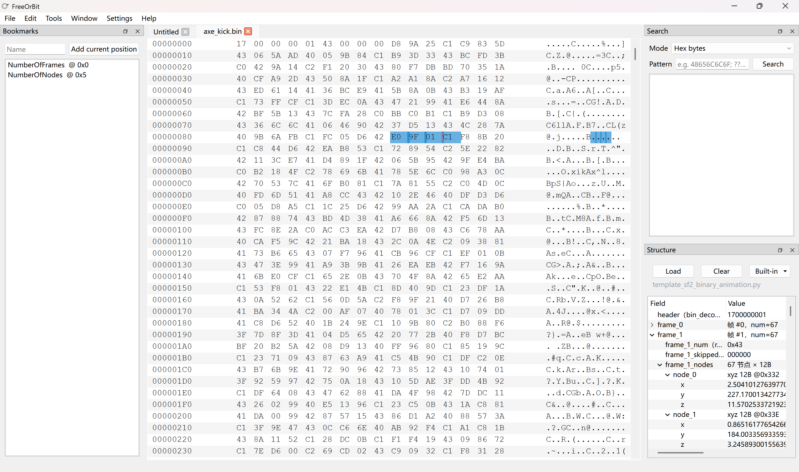

# FreeOrBit  一款免费开源的Hex Editor（16进制编辑器）



基于 **PySide6** 的十六进制 / 二进制编辑器，面向逆向、固件与数据分析场景。支持大文件（`mmap`）、多标签、暗色主题、中英文界面。

## 功能概览

| 类别 | 说明 |
|------|------|
| **编辑** | 十六进制 / ASCII 视图、插入/覆盖、撤销重做、跳转、书签、搜索高亮 |
| **搜索** | 十六进制模式；支持 `??` 单字节通配（如 `48??6C`） |
| **结构模板** | Python 模板：`build_field_tree(model)` → `FieldNode` 树；标量 `dtype` 写回；`builders` 辅助；内置模板（如 PE DOS 头）；扩展名 / Magic 自动匹配（设置中可配） |
| **脚本** | 受限 `EditorAPI`（`read` / `write` / `cursor` / `message` 等），见文档 |
| **工具** | 反汇编（Capstone，多架构）、填充/字节运算、文件比较、校验和 |
| **平台** | **Windows**：打开进程内存、原始磁盘/卷（需管理员）；其它平台以文件编辑为主 |

## 运行要求

- Python 3.10+
- 依赖见 [`pyproject.toml`](pyproject.toml)：`PySide6`、`QtAwesome`、`capstone`（Windows 下使用系统原生 `windowsvista` 界面样式）

## 从源码运行

在项目根目录执行：

```bash
pip install -e ".[dev]"
python main.py
```

或（已安装包或将 `src` 加入 `PYTHONPATH`）：

```bash
python -m freeorbit
```

## 文档

| 文档 | 说明 |
|------|------|
| [`python_script_api.html`](python_script_api.html) | 脚本面板 API（`editor`、受限 `__builtins__`） |
| [`python_template.html`](python_template.html) | 结构模板（Python）编写指南 |
| [`Scheme.md`](Scheme.md) | 产品策划、与 010 Editor 对照、已实现能力清单 |

## 打包（Windows，Nuitka 单文件）

先安装依赖与 Nuitka：

```bash
pip install -e ".[build]"
```

在项目根目录执行：

```powershell
.\build_nuitka.ps1
```

输出：`build/FreeOrBit.exe`。脚本默认启用 **onefile 内压缩**（体积较小）；若打包或首次解压时内存不足，可使用：

```powershell
.\build_nuitka.ps1 -OneFileNoCompression
```

打包说明（资源路径、图标、`QSettings` 行为等）见 [`build_nuitka.ps1`](build_nuitka.ps1) 顶部注释。

### Windows「智能应用控制」/ SmartScreen 提示未知发布者

本地构建的 `FreeOrBit.exe`**未经过代码签名**，系统可能提示「未知发布者」。可在拦截界面选择「更多信息」→「仍要运行」。正式对外分发需使用 **Authenticode 代码签名证书**（如 `signtool.exe`）；自签名证书通常无法消除此类提示。

## 许可

（请在此补充许可证信息。）
