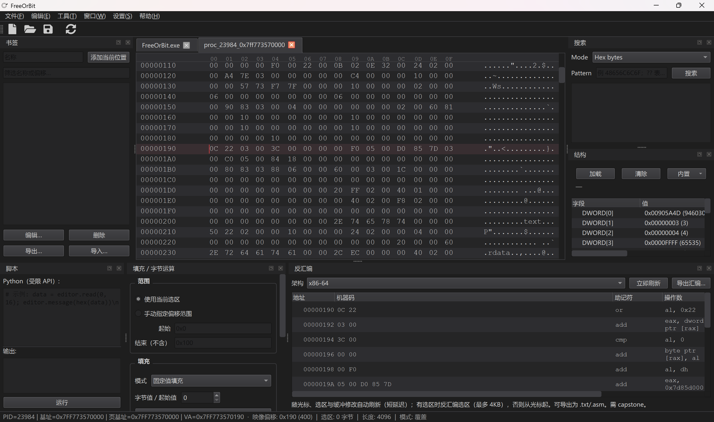

# FreeOrBit

一款免费开源的十六进制 / 二进制编辑器（Hex Editor），对标 010 Editor。



**当前版本：1.0.5**

基于 **PySide6（Qt 6）** 的桌面应用，面向逆向工程、固件分析、二进制数据检查。支持大文件（`mmap`）、多标签、**深色/浅色主题**、**中英文界面**（设置中切换）。

## 功能概览

| 类别 | 说明 |
|------|------|
| **编辑** | 十六进制 + ASCII 双视图、插入/覆盖模式、完整撤销/重做、**转到偏移**、**书签**（筛选/编辑/删除/**JSON 导入导出**）、搜索命中高亮、斑马纹行交替底色 |
| **搜索** | 十六进制与 **ASCII 字面量**搜索；十六进制模式支持 `??` 单字节通配（如 `48??6C`）；搜索结果列表面板 |
| **结构模板** | Python 模板：`build_field_tree(model)` → `FieldNode` 树；标量 `dtype` 写回；`builders` 辅助工厂；**扩展名 / Magic 自动匹配**（设置中可配规则）；**Ctrl+J** 光标定位到结构树字段；悬停字节显示字段路径；内置模板（PE DOS 头等） |
| **脚本** | 内嵌 Python 脚本面板：`EditorAPI`（`read` / `write` / `cursor` / `message` / `log_text`），支持代码编辑器、输出日志、受限沙箱执行，见 [`python_script_api.html`](python_script_api.html) |
| **工具** | **反汇编**（Capstone 多架构：x86/x64/ARM/ARM64/MIPS/RISC-V）、**字节填充/运算**（填充/AND/OR/XOR/NOT/ROL/字节交换）、**文件比较**（左右分栏同步滚动 + 字节级差异高亮 + 字节对比矩阵 Dot Plot）、**校验和/哈希**（MD5/SHA-1/SHA-256/SHA-512/CRC32/Adler-32）、**ORF 滑窗分析**（数值筛选 + 相位分组 + 偏移分布直方图） |
| **主题** | **深色 / 浅色主题**一键切换（设置 → 外观与行为 → 主题），全局 Fusion 风格，统一 6px 边距 / 8px 间距排版，暗色自绘组件（滚动条、菜单、分割条等） |
| **平台（Windows）** | **打开进程内存**（含模块枚举，Hex 左侧列显示模块名+RVA，类 Cheat Engine 体验）、**原始磁盘/卷**（需管理员权限）；**F5** 刷新外部缓冲 |
| **Android（可选）** | **窗口 → Android 调试面板**：ADB（设备列表/包名/ps/shell）+ **Frida** 附加与 GumJS 脚本注入 + 内存 Dump 到新标签；JS/TS 语法高亮；需 `pip install frida` 与设备端 **frida-server**（详见 [Scheme.md §8.7](Scheme.md)） |
| **其它** | 启动画面（暗色主题）、工具栏图标（QtAwesome / Font Awesome 5）、高 DPI 支持 |

## 运行要求

- Python **3.10+**
- 依赖见 [`pyproject.toml`](pyproject.toml)：**PySide6**（Qt 6）、**QtAwesome**、**capstone**
- 跨平台（Windows / macOS / Linux），Windows 下体验最佳

## 从源码运行

在项目根目录：

```bash
pip install -e ".[dev]"
# 可选：Android / Frida 面板
# pip install -e ".[dev,android]"
python main.py
```

或（将 `src` 加入 `PYTHONPATH`）：

```bash
python -m freeorbit
```

安装后也可直接：

```bash
freeorbit
```

## 文档

| 文档 | 说明 |
|------|------|
| [`python_script_api.html`](python_script_api.html) | 脚本面板 API 参考 |
| [`python_template.html`](python_template.html) | 结构模板（Python）编写指南 |
| [`Scheme.md`](Scheme.md) | 产品策划、与 010 Editor 功能对照、已实现能力清单 |

## 打包（Windows，Nuitka 单文件）

安装构建依赖：

```bash
pip install -e ".[build]"
```

在项目根目录执行：

```powershell
.\build_nuitka.ps1
```

输出：`build/FreeOrBit.exe`（约 57 MB，zstd 压缩单文件）。若压缩阶段内存不足，可使用无压缩模式：

```powershell
.\build_nuitka.ps1 -OneFileNoCompression
```

详细说明见 [`build_nuitka.ps1`](build_nuitka.ps1) 顶部注释。

### Windows「智能应用控制」/ SmartScreen

本地构建的 `FreeOrBit.exe` **未代码签名**时，系统可能提示未知发布者。可在拦截界面选择「更多信息」→「仍要运行」。正式分发建议使用 **Authenticode** 证书签名。

## 许可

### [Apache License 2.0](LICENSE)

### 软件最终解释权归作者 PrivateLiu 所有
